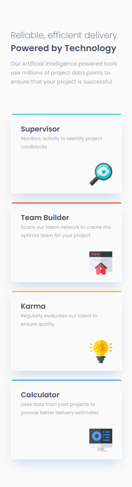
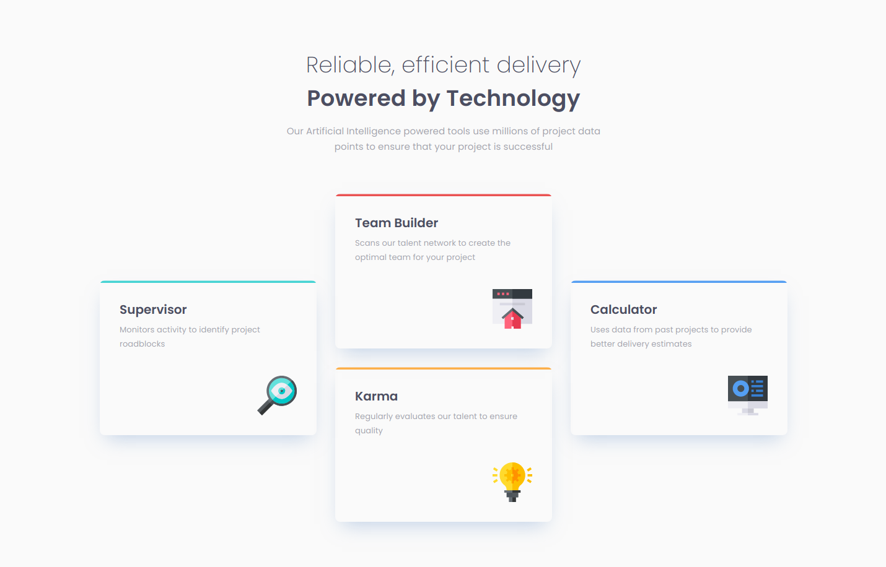

# Frontend Mentor - Four card feature section solution

This is a solution to the [Four card feature section challenge on Frontend Mentor](https://www.frontendmentor.io/challenges/four-card-feature-section-weK1eFYK). Frontend Mentor challenges help you improve your coding skills by building realistic projects. 

## Table of contents

- [Frontend Mentor - Four card feature section solution](#frontend-mentor---four-card-feature-section-solution)
  - [Table of contents](#table-of-contents)
  - [Overview](#overview)
    - [The challenge](#the-challenge)
    - [Screenshot](#screenshot)
    - [Links](#links)
  - [My process](#my-process)
    - [Built with](#built-with)
    - [What I learned](#what-i-learned)
  - [Author](#author)

## Overview

### The challenge

Users should be able to:

- View the optimal layout for the site depending on their device's screen size

### Screenshot




### Links

- Solution URL: [https://www.frontendmentor.io/solutions/four-card-feature-section-jlGEMaBVu](https://www.frontendmentor.io/solutions/four-card-feature-section-jlGEMaBVu)
- Live Site URL: [https://hardcore-sammet-889f6d.netlify.app/](https://hardcore-sammet-889f6d.netlify.app/)

## My process

### Built with

- Semantic HTML5 markup
- CSS custom properties
- Flexbox
- CSS Grid
- Mobile-first workflow

### What I learned

Using both grid and flexbox made this project very simple; however, I did struggle with getting the color border to work properly. I initially used the "border-top" property, but it resulted in a top border that curved with the curved border-radius.

Thankfully I was able to find the overflow property! I created a blank div to hold the border and push it up and act like a top border.

```css
.info-block-wrapper {
    border-radius: 8px;
    overflow: hidden;
    position: relative;
    -webkit-box-shadow: 0px 15px 30px -11px rgba(131, 166, 210, 0.5);
    -moz-box-shadow: 0px 15px 30px -11px rgba(131, 166, 210, 0.5);
    box-shadow: 0px 15px 30px -11px rgba(131, 166, 210, 0.5);
  }

  .color-div {
    border-bottom-style: solid;
    border-bottom-width: 3.55px;
    bottom: 98.4%;
    position: absolute;
    width: 100%;
  }

  .cyan-border {
    border-bottom-color: hsl(180, 62%, 55%);
  }

  .red-border {
    border-bottom-color: hsl(0, 78%, 62%);
  }

  .orange-border {
    border-bottom-color: hsl(34, 97%, 64%);
  }

  .blue-border {
    border-bottom-color: hsl(212, 86%, 64%);
  }
```

## Author

- Website - [Miguel Tostado](https://www.migueltostado.com/)
- Frontend Mentor - [@miguel-tostado](https://www.frontendmentor.io/profile/miguel-tostado)
- Twitter - [@207Toast](https://twitter.com/207Toast)
